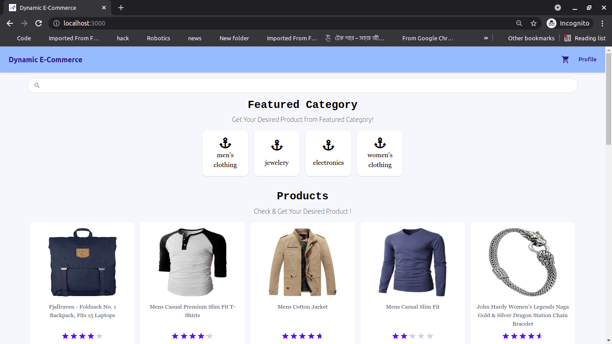
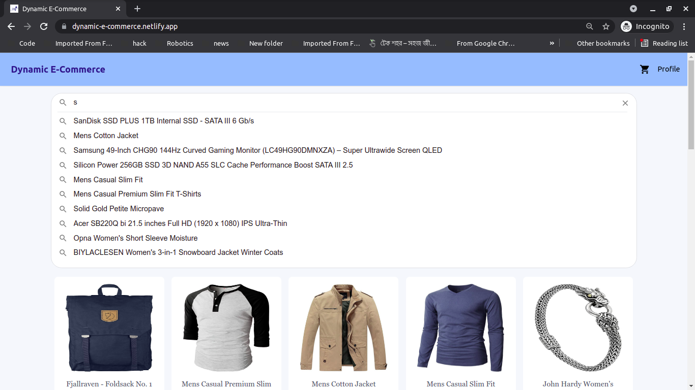
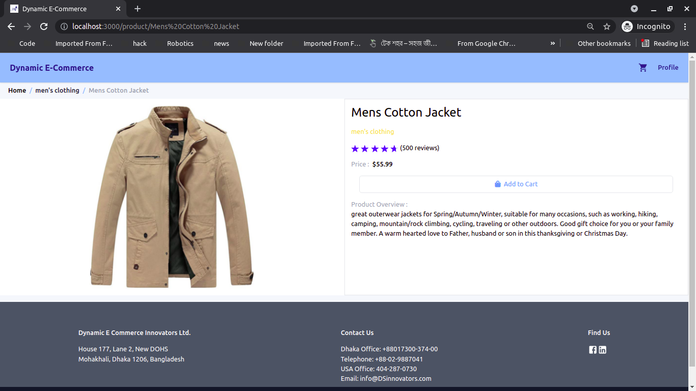
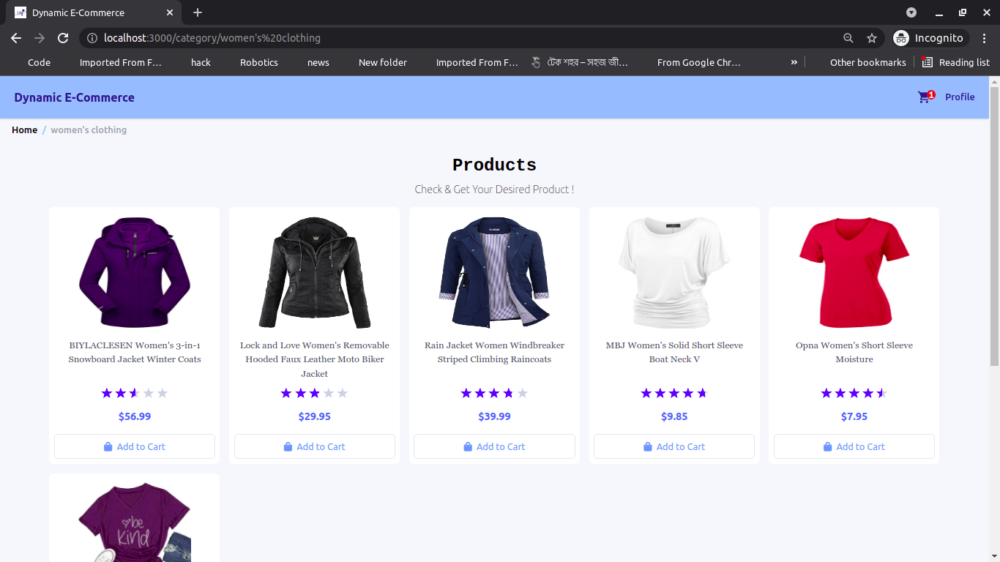
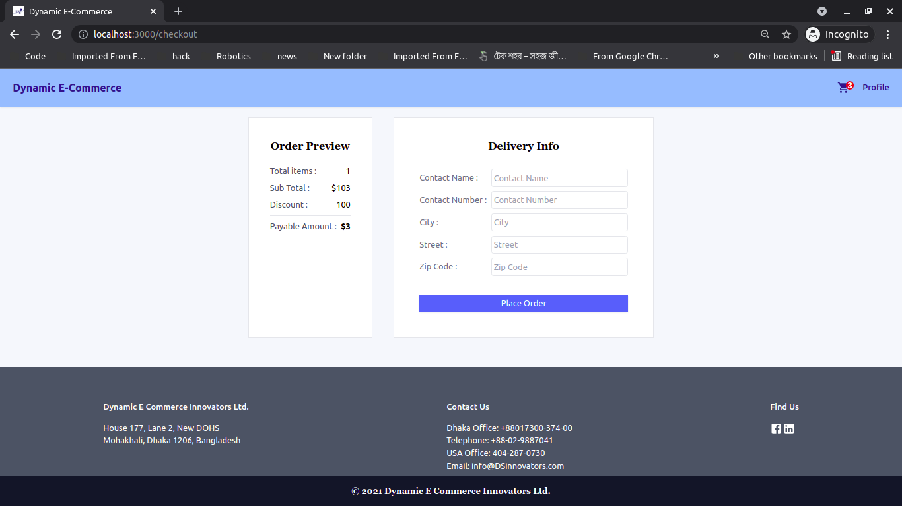
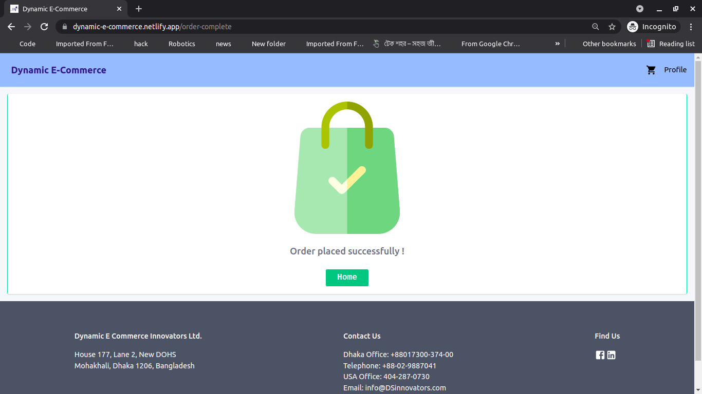
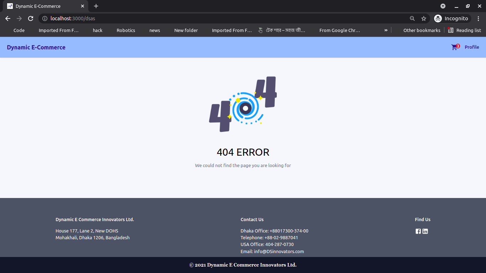

# Dynamic E-Commerce With Redux

## Intro

Dynamic E-Commerce is basically a simple E-Commerce application where customer can view products as well as categories and order their chosen products.

As an intern in DSinnovators we are going through some session (**javascript**, **react** for now) and some tasks are given by our mentor (Yousha vai). This was one of them.

So far, I have implemented ->

- Home page (`/`)
  - Search Product based on product and category
- Single Product View (`/product/:product-title`)
- Category Products View (`/category/:category`)
- Order Checkout Page (`/checkout`)
- Order Complete Page (`/order-complete`)
- 404 Error Page (`/*`)

<p align='center'>Hosted on : <a href="https://redux-e-commerce.netlify.app/">Netlify</a></p>

## About Task

### [Previous Task](https://github.com/jspw/DE-Commerce) (which is related to this one)

```

You are to prepare the frontend of an e-commerce website.
Requirements
Clone this frontend https://e-commerce-frontend-react.netlify.app/
Tools needed to be used:
React
Context Api
fetch/axios
Routing
Tailwind css
localStorage for data persistence
Suggestions
UI should be beautiful, buttery smooth and super responsive
While showing the products in a row, you should insert a mechanism to control the number of products you want to show per row, as it should be consistent throughout the application
Make sure the overall UX is stimulating and raises minimum questions
Backend api : https://fakestoreapi.com/products

Good Luck!

```

### Main Task (This repo)

```
You are to rewrite the previously written e-commerce application with some new technologies:
redux
redux-thunk(not mandatory)
Added Requirements:
The data needs to be persisted. Any data, input from the user, needs to be persisted on refresh. Also, you are allowed only one network call to the api to fetch data from server, after that you need to implement a system to save that data too.
You are to write a custom modal component which can be configured and reused for later projects. It should accept props like height, width, position(X-Y axis) etc
You are to write a custom hook to fetch the data from server and save it in your localstorage so that you dont make any network calls next time you show the products list.
For persistence in redux, you can look up redux-persist, a really easy-to-use library.
Make a new repository for this, and drop the github link and live link only under this to-do as comment.
Good Luck!

```

## Tech Stack

- Frontend : **ReactJS**
  - global state management : **redux**
    - for async : **redux-thunk**
    - for persistance : **redux-persist**
- CSS Framework : **TailwindCss**

## Codebase Structure

```
src
├── api
│   ├── client.js
│   └── products.js
├── App.jsx
├── assets
│   └── images
│       ├── 404.png
│       ├── default_product.png
│       ├── logo.jpeg
│       ├── order-complete.png
│       └── shopping.png
├── components
│   ├── Cart
│   │   ├── CartItem.jsx
│   │   ├── CartItems.jsx
│   │   └── CartModal.jsx
│   ├── Category
│   │   ├── Categories.jsx
│   │   └── Category.jsx
│   ├── Checkout
│   │   ├── Address.jsx
│   │   └── OrderPreview.jsx
│   ├── Footer
│   │   └── Footer.jsx
│   ├── Loader
│   │   └── MyLoader.jsx
│   ├── NavBar
│   │   └── NavBar.jsx
│   ├── Products
│   │   ├── Product
│   │   │   ├── CartAction.jsx
│   │   │   └── Product.jsx
│   │   └── Products.jsx
│   ├── Rating
│   │   └── Rating.jsx
│   ├── SearchBar
│   │   └── SearchBar.jsx
│   └── Spinner
│       └── Spinner.jsx
├── index.css
├── index.js
├── Navigation
│   ├── AppRoutes.jsx
│   └── Wrapper.jsx
├── pages
│   ├── Category.jsx
│   ├── Checkout.jsx
│   ├── Home.jsx
│   ├── OrderSuccess.jsx
│   ├── Page404.jsx
│   └── ProductDetail.jsx
├── redux
│   ├── actions
│   │   ├── cartActions.js
│   │   ├── modalActions.js
│   │   ├── productActions.js
│   │   └── userActions.js
│   ├── actionTypes
│   │   ├── cartActionTypes.js
│   │   ├── modalActionTypes.js
│   │   ├── productActionTypes.js
│   │   └── userActionTypes.js
│   ├── reducers
│   │   ├── cartReducer.js
│   │   ├── index.js
│   │   ├── modalReducer.js
│   │   ├── productReducer.js
│   │   └── userReducer.js
│   └── store
│       └── store.js
└── utility
    └── helpers.js


```

## Screenshots

### Desktop








